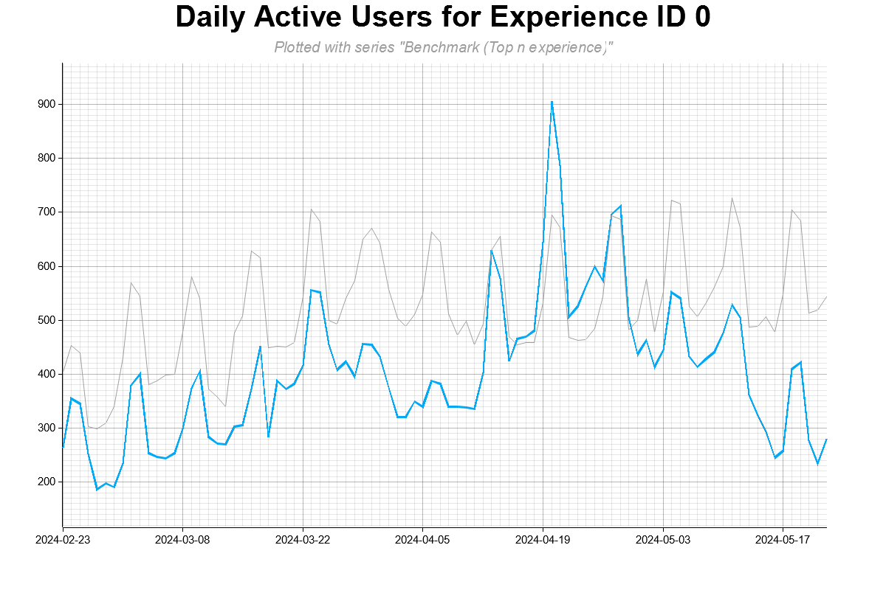
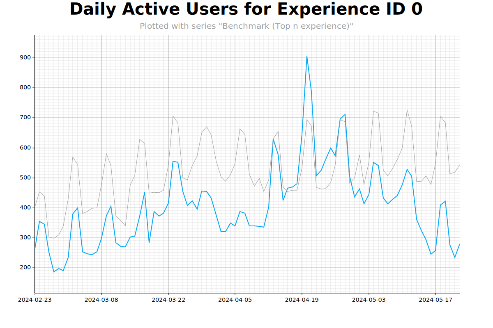
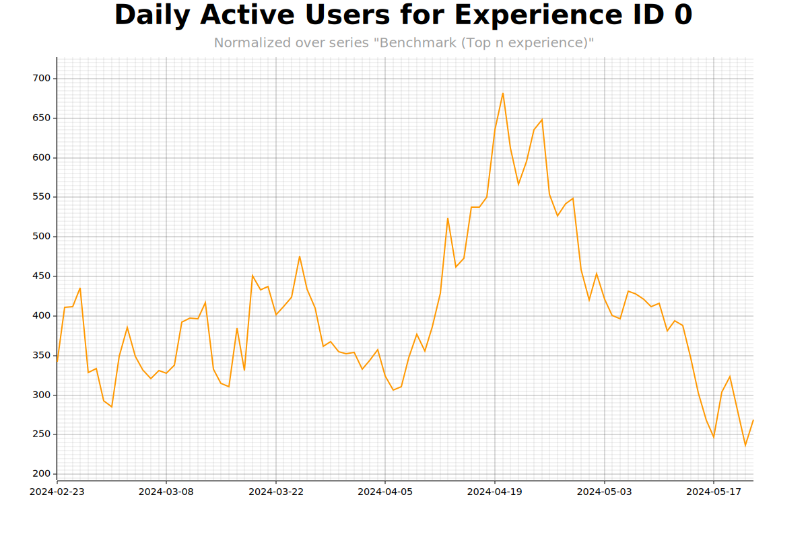

# Rasorite

--- 

Rasorite is a CLI tool for plotting Roblox analytics and benchmark data.

## Installation

### Aftman

If you use [Aftman](https://github.com/LPGhatguy/aftman), you can install the latest release globally using:

```bash
aftman add --global chemiclast/rasorite
```

### Cargo

If you have Rust installed, you can clone this repository and install the binary using Cargo:

```bash
git clone https://github.com/chemiclast/rasorite.git
cd rasorite
cargo install --path .
```

### Releases

Download the latest binary for your architecture from
the [releases page](https://github.com/chemiclast/rasorite/releases).

## Limitations

Rasorite only supports KPIs that provide benchmarks as a single series rather than a range. As of writing, the KPIs that
adhere to this are:

* Analytics → Engagement
    * Daily Active Users
    * Monthly Active Users
    * Sessions
    * Total Playtime
* Monetization → Overview
    * Daily Revenue
    * Paying Users

## Usage

Once you have exported your data from your analytics dashboard in CSV format, you can generate a plot by specifying the
input file and destination path. For instance, to generate a plot from `analytics.csv` and save it as `plot.png`, you
would run:

```bash
rasorite -i analytics.csv plot.png
```



Rasorite also supports vector graphics stored in the SVG format. To generate an SVG plot, simply specify the output file
with the `.svg` extension:

```bash
rasorite -i analytics.csv plot.svg
```



### Normalization

To normalize the analytics data to the benchmarks provided by Roblox, you can use the `-n` flag. This will adjust the
analytics data to account for fluctuations in the benchmarks provided. For example, to normalize the analytics data
in `analytics.csv` and save the plot as `plot.svg`, you would run:

```bash
rasorite -i analytics.csv -n normalized.svg
```



If benchmark data is not found in the analytics file, Rasorite will output a warning and will instead plot the raw
analytics data without normalization.

Normalization is performed rather simply by obtaining a normalization factor for each data point from the ratio of the
mean of the benchmark data to the benchmark value corresponding to the data point. This factor is then multiplied by the
data point to obtain the normalized value.

```
$$
x_{\text{normalized}} = x \cdot \frac{bench_{\text{mean}}}{bench_{x}}
$$
```

### Behavior upon Completion

By default, Rasorite will attempt to open the generated plot in your default image viewer once it is complete. To
disable this behavior, you can pass the `-s` (`--silent`) flag to suppress the opening of the image.

```bash
# Will attempt to open the plot upon completion
rasorite -i analytics.csv plot.svg

# Will not do that
rasorite -i analytics.csv -s plot.svg
```

## Motivation

Analytics obtained from Roblox experiences can be difficult to analyze and make actionable insights upon due to the
nature of the platform's consumer base. It can often be difficult to tell whether a given deviation in typical
statistics is due to a genuine change in the experience's performance or if numbers are simply fluctuating as a result
of a school holiday. While viewing benchmarks in tandem with analytics data can help to alleviate this issue, it often
leaves one desiring a simple view that would adjust numbers for the ebb and flow of the platform's userbase. This tool
aims to provide that view via the `-n` flag, which normalizes the analytics data to the given benchmark data provided by
Roblox.